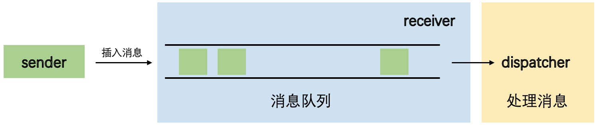

# 《c++并发编程实战》——消息传递框架ATM实例

## 写在前面

官方给的实例代码存在一个小错误，需要定义一个互斥元才可以正常运行。代码均在MacOS上实现编译运行，
linux系统若存在线程库的报错，可添加相关依赖解决。
```c++
std::mutex iom; ////< @note in ui_state_machine.h L15
```

## 项目功能

主要实现的功能是模拟用户在ATM机存取款，创建几个线程处理用户的操作。

## 对消息框架的理解

三个状态机(`bank_machine`)以`receiver`的形式持有消息队列，而`receiver`持有类型转换函数，
所以在`main`函数中可以通过`Messaging::sender atm_queue(machine.get_sender());`将消息队列
的指针传递到`sender`当中，接下来`main`函数通过`sender`对象向消息队列传输消息。

消息队列通过将STL容器的`front()`和`pop()`放在一起操作，并用互斥元锁定实现了线程安全。


## gdb调试记录

在cmake文件中加入`set(CMAKE_BUILD_TYPE DEBUG)`支持gdb调试。

接着`gdb practiceMultiThread`启动多线程调试。
出现`Reading symbols from practiceMultiThread...done.`
表示进入debug模式成功

通过`b 行号`打断点

`r`运行程序，程序会在碰到第一个断点后停下来

`p var`查看变量的值

通过`info threads`可以查看运行的线程

### 利用core文件调试

Coredump叫做核心转储，它是进程运行时在突然崩溃的那一刻的一个内存快照。操作系统在程序发生异常
而异常在进程内部又没有被捕获的情况下，会把进程此刻内存、寄存器状态、运行堆栈等信息转储保存在
一个文件里。

该文件也是二进制文件，可以使用gdb、elfdump、objdump或者windows下的windebug、solaris下的
mdb进行打开分析里面的具体内容。

在linux环境，首先设置`ulimit -c unlimited`使机器可以产生core文件

然后使用`gdb [exec file] [core file]`进入core环境

接着使用`bt`命令查看具体是哪一行出错

## 踩坑记录

**bug1**

因为在C++有标准线程库之前，Linux下已经存在了一个线程库pthread。Linux上
的std::thread其实就是对之前存在的pthread的一层包装。所以在linux服务器
上使用std::thread，需要在cmake中添加：
```cmake
find_package(Threads REQUIRED)
target_link_libraries(practiceMultiThread PRIVATE Threads::Threads)
```

**bug2**

编译时报错`Cannot initialize a member subobject of type 'queue *' with an lvalue of type 'const Messaging::queue *'`。
这个错误的根源在于`const Messaging::queue*`是一个指针，且这个指针指向`Messaging`命名空间
中的常量队列，而将要被赋值的指针指向非常量队列，这意味着完成赋值后原本的常量队列可通过指针修改，
所以报错。

而我们仍应采用`void func(const std::string &str)`这样的函数头，是因为`str`是拷贝赋值，即便新的
变量修改了字符串的内容，也不会影响str的内容，所以没有关系。

**bug3**

友元类和友元函数在使用时都要将对象作为参数传进来，否则编译器无法知晓操作的成员变量属于哪个对象
